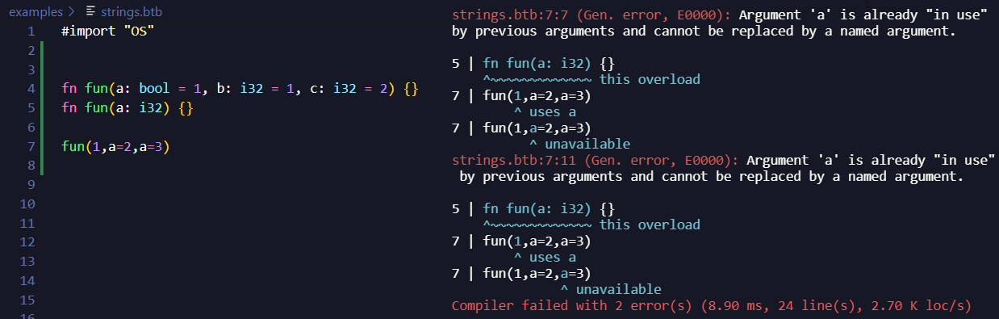
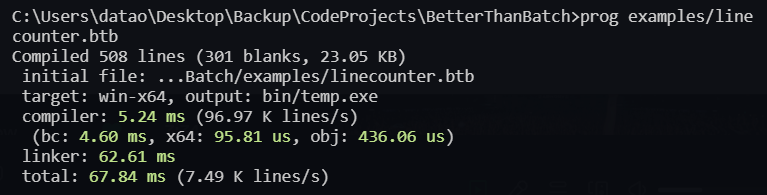

# BetterThanBatch
A compiler for a new programming language.

It will be better than batch for your average scripting needs.
It will be useful for making neat programs, exploring data structures
and visualising data using a straight forward rendering
library (abstraction of Vulkan or OpenGL).

Inspiration from:
- Jai (by Jonathan Blow)
- Batch file (not for the reason you think)
- C
- and a bit of Rust

Example of errors with named arguments

The image below shows the compiler's performance.
The compiler was compiled by the MSVC compiler with /O2 optimization.
The compiler is about 3 times slower without the optimization flag.

You can find more measurements in [perf-2023-08-06-O2.txt](docs/stats/perf-2023-08-06-O2.txt).
rdtsc was used. 2.9 GHz is the clock speed of my laptop. The power cable was plugged in
my laptop. I get slower results when it's not plugged in.
The measurement is probably not very accurate but it gives you an idea
of the compiler's speed and moving forward we will know whether it
became faster or slower because I will test it again on the same computer with same
settings (power cable plugged in). In the future, I will write a program
with 2000 to 6000 lines of code which should also give more accurate
results when compiled. Then we will know if the correlation between time
and lines of code is linear or exponential (or something else).

I want to emphasize that I don't know how to measure a program's performance
correctly. Take all measurements with a large quantity of salt just in case I have
made a mistake.

## Disclaimer
The compiler is very unstable at the moment. It isn't
ready to be used by anyone.

It only works on Windows at the moment.
It will however work on other operating systems.

The documentation is old, minimal and outright lacking.
This is due to me prioritizing the features and stability
of the compiler. Once some of the hard features that would
require major alterations to the compiler's architecture if
not done early has been completed, partly at least, then
I shall spend time on examples, documentation and most
importantly proper testing.

## Where is the focus
- Small but useful standard library (graphics, audio, file formats, networking)
- Fast compiler with a smooth user experience. You don't need to setup a project folder and a build system to compile a single file.
- Code execution at compile time.
- Cross platform (not in focus yet but will be)

## Features
- #import to divide your code into multiple files
- #include to tokenize a file and transfer the tokens into another file.
- Polymorphism in structs, functions and methods (there are some bugs in advances scenarios)
- Function and operator overloading
- x64 code generator (object files)
- Compiling with debug information (Windows only)
- Linking with C/C++ functions from libraries and object files (symbols and relocations)
- #define, #multidefine and #undef (macros/defines are recursive)
- #ifdef (exactly like C)
- #unwrap (for macros)
- Concatenation with ## in macros.
- Variables, functions, namespaces, structs, enums.
- If, for, while, break, continue, return, defer, using.

## On the way
- Shell-like way of calling executables
- Thorough documentation
- Constant evaluation and compile time execution

## The processs
The name of each step may not accurately represent what's
actually happening. Type checker infers and creates types for
structs, enums and functions. The generator also does some
more detailed type checking with expressions and when the
values are put in registers and pushed to the stack.

Some preprocessing is done after the parser like
\_FUNCTION\_ which isn't know until after parsing.

- Tokenizer     (text -> tokens)
- Preprocessor  (tokens -> tokens)
- Parser        (tokens -> AST)
- Type checker  (modifies types in AST)
- Generator     (AST -> bytecode)
- Optimizer     (bytecode -> faster and smaller bytecode)
- Interpreter   (runs the bytecode, compile time execution)
- x64 Generator (bytecode -> object file)

## Examples
You can find some examples in the example folder.
[Random code](examples/ast.btb) (some are broken and not up to date)

# Usage
You may want to read [Building](#building) first.

The official usage of the compiler has not been established yet.
You can at least do `compiler yourfile.btb` to compile and run the initial file.
`compiler --help` may provide more options.

Here is a short and quick [Guide](docs/guide.md) (also not up to date, sorry).

# Building
## Windows
### Building with vcvars (with Visual Studio installed)
First you need Visual Studio installed. Then you need to find vcvars64 in
`C:\Program Files\Microsoft Visual Studio\2022\Community\VC\Auxiliary\Build`.
The exact directory depends on the version and location of your installation.

Clone the repository through git or download the files from github.
Start a new terminal inside the project (the folder where `build.bat` exists).
Type in the path to `vcvars64.bat`. This will setup the command cl which is
used to compile the compiler.
Then run `build.bat` which will generate an executable in the bin directory.
That is the compiler compiled and ready for compilation.

I would recommend adding the directory of vcvars64 in your user environment variable PATH.
With this, you can type `vcvars64.bat` instead of the long directory path.

### Building with g++ (MinGW or CYGWIN)
First you need to install MinGW-64 (or CYGWIN?).
You can modify `build.bat` to compile with g++ instead of cl (MSVC).
This is done by removing `SET USE_MSVC=1` and adding (or uncommenting) `SET USE_GCC=1`.
Then simply build with `build.bat`. The compiler can be found in the folder bin.

## Linux
Tested with Windows Subsystem for Linux. You may therefore experience
some bugs that have not been found when using Linux for real.

Clone or download files from the repository.
Build with `build.sh`. The compiler can be found in the bin directory found in bin.
