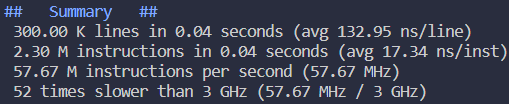

# BetterThanBatch
A compiler and interpreter for a new scripting language.

## Disclaimer
- This version/branch of the language is abandoned because it
  has some major flaws like no structs or proper stack management. 
- Limited functions to to interract with the operating system.
- Windows only.

## Features
- Variables
- Math expressions
- If statements
- For and while loops
- Break and continue
- Functions
- Usage of C++ functions within a script
- Calling executables like gcc.exe
- #define, #multidefine and #undef (macros/defines are recursive)
- #ifdef (exactly like C)
- #unwrap (for macros)
- Concatenation (.. instead of ## from C)
- Asynchronous functions and multithreading (no locks)

Language has weak typing (C is strong while Javascript is weak)

See the Guide/Walkthrough [](docs/guide.md)

## The processs
- Tokenizer     (text -> tokens)
- Preprocessor  (manipulates tokens)
- Parser        (tokens -> bytecode)
- Optimizer     (improve speed and size of bytecode)
- Interpreter   (runs the bytecode)

The parser does parsing and code generation which was easier to implement but
comes with an issue of everything having to be declared before being used.

## Performance (rough measures)
```
sum = 0
for 1000000 {
    sum = sum + #i
}
```


The statistics comes from the code above.
The compiler and intepreter was compiled with MSVC
and O2 optimizations (no debug). The statistics
is there to give some idea of how slow the intepreter
is. More thorough testing with consideration to hardware
specification will be done later.

## Example (Fibonacci)
```
N = 10
last = 1
now = 1
temp = 0
for N {
    print now
    temp = now
    now = now + last
    last = temp
}
```

## La spécialité
```
FILES = main.cpp compiler.cpp
g++ FILES -o program.exe
```
GCC and any other executable found in environment variables
can be run like a shell script. Just like batch.

## Building (currently only on Windows with Visual Studio installed)
Running the commands below will allow you to compile the project.
vcvars64 can usually be found in `C:\Program Files\Microsoft Visual Studio\2022\Community\VC\Auxiliary\Build`.
```
.../vcvars64.bat
build.bat
```
If it doesn't work then you are on your own since this is a deprecated version of the compiler.

## Decisions
The syntax of the language, weak typing and intepreter has been
chosen because they seem easier to implement than their opposites.
Each side has positive and negatives depending on what the
language will be used for. The language will be used
for mundane and repetitive tasks on your own computer which
is why weak typing and the syntax has been chosen. You preferably don't
want to be annoyed by types when you make a script to get all .cpp files
in a directory and count the number of lines or compile the source files.
The language makes this very easy. Simular to a shell language.
