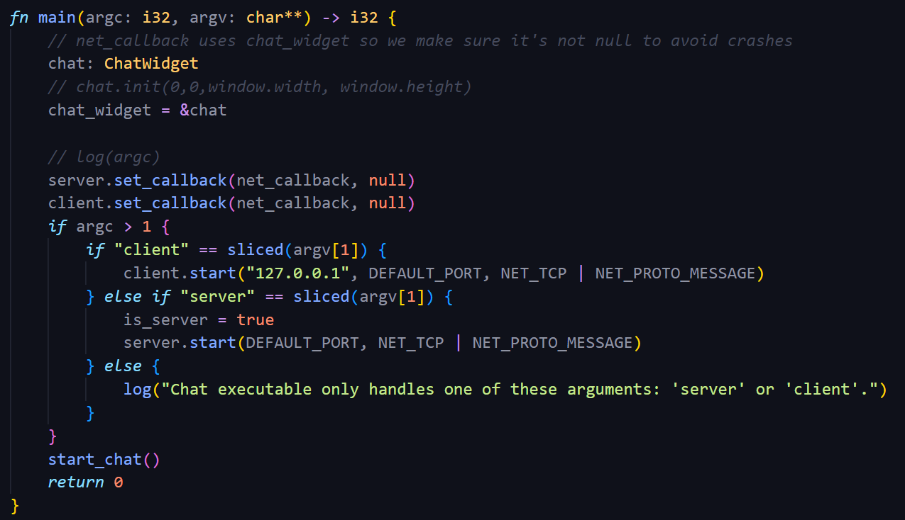

# Highlighting for the BTB language

This plugin provies syntax highlighting for the BTB language and makes sure vscode recognizes text in .btb files as a programming language allowing you to toggle comments among other things.

## Features

- Syntax highlighting for .btb files

The extension does not support hints, suggestions or syntax errors, just highlighting. There are plans to implement a language server but that may be in 1-2 years (maybe more).

**WARNING:** The syntax highlighting does not fully reflect if code will compile or not. It is just a bit of color to make it more pleasant to work with.

## Installing

### From the Marketplace
1. Open Visual Studio Code.
2. Go to the Extensions view (`Ctrl+Shift+X`).
3. Search for "btb lang" and click **Install**.

### From VSIX
1. Download the `.vsix` file from [Releases](https://github.com/Emarioo/BetterThanBatch/releases).
2. Open Visual Studio Code.
3. Go to the Extensions view, click `...`, and select **Install from VSIX...**.

**NOTE**: This extension currently lives inside the `btb-lang` directory in the repository for the compiler/language: `https://github.com/Emarioo/BetterThanBatch`.